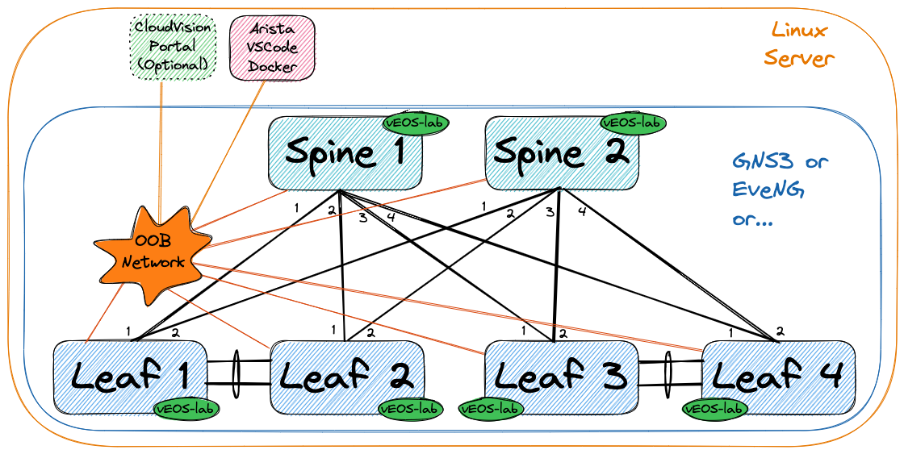
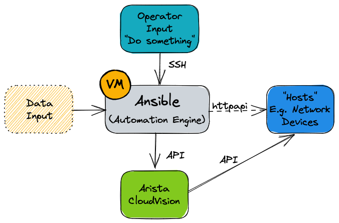
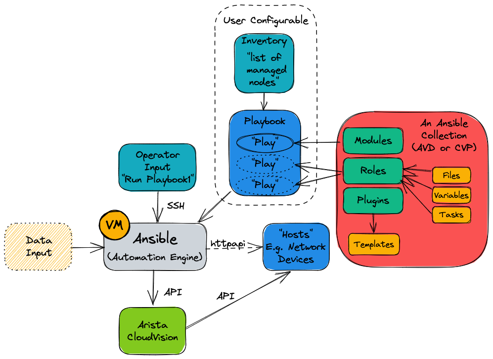
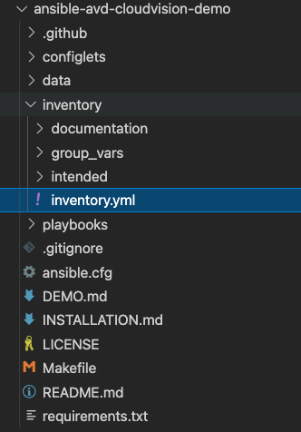
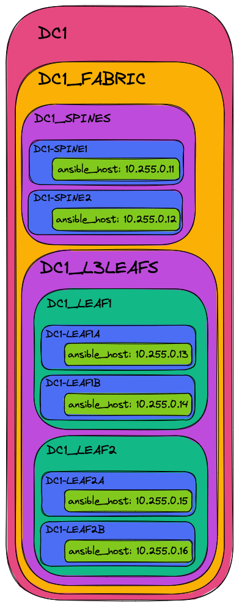
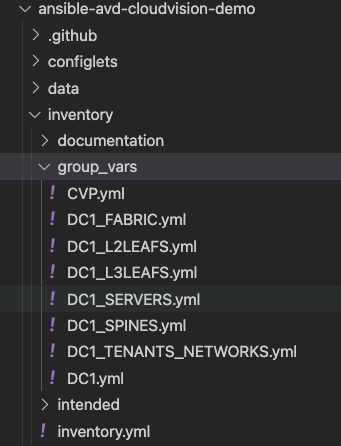

# Table of Contents <!-- omit in toc -->
- [Ansible and AVD Overview](#ansible-and-avd-overview)
  - [Day 1 operation i.e. provisioning a network from scratch](#day-1-operation-ie-provisioning-a-network-from-scratch)
  - [What is Ansible](#what-is-ansible)
  - [What is required to run Ansible](#what-is-required-to-run-ansible)
  - [What is Ansible AVD (Ansible collection for Arista Validated Designs)](#what-is-ansible-avd-ansible-collection-for-arista-validated-designs)
  - [When to use Ansible AVD and when not to](#when-to-use-ansible-avd-and-when-not-to)
  - [Change your mindset and culture](#change-your-mindset-and-culture)
  - [How does Ansible work](#how-does-ansible-work)
    - [Inventories](#inventories)
    - [Organizing host and group variables](#organizing-host-and-group-variables)
    - [Group Variables](#group-variables)
    - [Playbooks](#playbooks)
  - [Source of Truth](#source-of-truth)
  - [How do I use Ansible AVD:](#how-do-i-use-ansible-avd)
  - [Day 2 Operations](#day-2-operations)

# Ansible and AVD Overview
## Day 1 operation i.e. provisioning a network from scratch
Imagine being tasked with installing and configuring a leaf-spine network with 2 spine switches and 4 leaf switches from scratch:



Traditionally, one would grab a laptop, a console cable and perhaps a USB key containing the Arista EOS image of choice.
This would mean a tedious device by device process of performing a software upgrade and typing configuration commands manually.
Alternatively by using pre-developed config snippets based on reading the relevant
Arista design guides and/or previous experience*(did anyone think of copy/paste from existing devices!?)*.
The configurations would be manually adapted per device, which is time consuming.
The operator could easily become burned out, leading to user and design errors.

Using Ansible Arista Validated Designs (AVD), such a task is automated, greatly simplified and many times faster,
where all the “basic” network configuration is guaranteed to be identical across the entire fabric from day one.
No longer do you have to manually inspect each and every device for errors and this also applies when updating the
configuration in day 2 operations. In addition, you do not have to spend any time integrating the Arista Design and Deployment Guides,
since Ansible AVD is built on those as a foundation. Ansible AVD also fully integrates with Arista Cloudvision,
which adds a full change control workflow, continuous compliance checks,
network topology overview as well as real time streaming telemetry including flow based data and more.

## What is Ansible
Ansible is an open source tool, that can be thought of as an “automation engine” that will execute the tasks you tell it to,
in a uniform and secure way with idempotency built in. Idempotency!?
<br>
It means that repeating a task will not change or overwrite anything - it will always produce the same result.
<br>
Tasks in Ansible are executed based on structured data, written in a format called YAML.
<br>
YAML will be covered later in the section “How does Ansible Work”.

Ansible can be used to automate many things. In this document, we’re only focusing on the use of Ansible to help us
automate the provisioning of Arista network devices either directly from Ansible or via Arista Cloudvision.

## What is required to run Ansible
Ansible can run on almost anything, but in production scenarios, we typically see Ansible deployed on a virtual Linux server,
running on the customer’s preferred hypervisor. This Ansible server then communicates either directly with the
Arista network devices or with Arista CloudVision Portal, which in turn communicates with the Arista network devices.
Controlling what Ansible does is typically done using a SSH terminal session to the Ansible server from the Operator’s computer.
Using Ansible to control an Arista network infrastructure is agentless,
i.e. it requires nothing additional to be installed on the Arista network devices or Arista CloudVision Portal.



## What is Ansible AVD (Ansible collection for Arista Validated Designs)
While Ansible is the automation engine, Ansible AVD is a “collection” added to Ansible.
It is an open source project hosted on GitHub and maintained by Arista, letting users contribute directly. 
A “collection” is a distribution format for Ansible content that can include roles, modules, and plugins.
These topics are most likely new to you, but do not worry, they will be described in later sections.
For now, just remember that a “collection” is a way to easily share and distribute Ansible data.
You can install and use collections through Ansible Galaxy, which is Ansible’s official hub for sharing Ansible content.



In the illustration above, the Ansible AVD collection is shown as the box with the red background on the right hand side. 
When designing an EVPN Layer 3 Leaf Spine (L3LS) fabric you don't need to be an expert on Arista Design and Deployment Guides.
All those rules and guidelines are integrated in the Ansible collection for Arista Validated Designs (AVD), or in short: Ansible AVD.
<br>
Ansible AVD is an opinionated collection, meaning that field experiences and best practices are also included.
With Ansible AVD, users get up and running quickly without having to invent every part of the network configuration from scratch.
This means only the most basic information must be provided by the user to get a new fabric up and running.
 
Examples could be:
- Username/password for network devices and Cloudvision
- OOB management IP range
- IP scope for link addresses
- IP scope for loopback interfaces
- VLAN and VNI ranges
- Device hostnames
- And so on

All are details that must be decided upon in any fabric design. In a standard spine-leaf topology,
Ansible AVD takes care of all the work past the theoretical design.

## When to use Ansible AVD and when not to
It’s important to mention when to, and perhaps more importantly, when not to use Ansible AVD:
<br>
Automating provisioning of a network infrastructure makes most sense when the network is designed and built using clearly defined,
repeatable patterns. It makes less sense when a network infrastructure is using a non-uniform design.
Although you can use Ansible AVD to provision a non-uniform network while harvesting some benefits,
you’re creating a lot of manual work and customization of Ansible AVD to achieve what you need,
essentially making it much harder to maintain going forward.

## Change your mindset and culture
Many network engineers prefer to use the CLI for all things networking, be it troubleshooting, ad-hoc operational configuration changes
or full blown greenfield provisioning tasks. To harvest the full benefit of Ansible and Ansible AVD,
you must think differently and change your ways of working. Ansible should be your first choice when changing your network configuration,
be it small or big. The CLI should only be used for troubleshooting i.e. viewing the state of your network,
or those urgent scenarios at 2am where you need to change something very specific on just one or two devices
followed by proper configuration cleanup later.

## How does Ansible work
Before we can tell Ansible to do anything, Ansible needs to know about the devices (or hosts as Ansible calls it) it handles.
<br> 
This is defined in the Ansible ***inventory*** or actually inventory.yml, which is another text file in YAML format,
located in a folder that is also called inventory:



### Inventories
An example of an what's inside the inventory.yml file could be what is shown below (subset of an actual file for clarity).
As stated earlier this file is in [YAML](https://yaml.org) format. Also note that the IP addresses shown below are only an example of
the management IP addresses for the different devices. These can of course be adapted to fit any topology.

```all:
  children:    
    # DC1_Fabric - EVPN Fabric
    DC1:
      children:
        DC1_FABRIC:
          children:
            DC1_SPINES:
              hosts:
                DC1-SPINE1:
                  ansible_host: 10.255.0.11
                DC1-SPINE2:
                  ansible_host: 10.255.0.12
            DC1_L3LEAFS:
              children:
                DC1_LEAF1:
                  hosts:
                    DC1-LEAF1A:
                      ansible_host: 10.255.0.13
                    DC1-LEAF1B:
                      ansible_host: 10.255.0.14
                DC1_LEAF2:
                  hosts:
                    DC1-LEAF2A:
                      ansible_host: 10.255.0.15
                    DC1-LEAF2B:
                      ansible_host: 10.255.0.16
```

Don’t confuse ***hosts*** with servers or similar. A host can be anything that can be accessed via SSH or an API,
including Arista switches, which will be what we’re focusing on going forward.

The settings inside the inventory.yml file are defined in a tree-like structure using what is called ***groups***,
used to make it easier to apply common configuration to a group of devices.
The ***all*** line at the top is a default group that contains all ***hosts*** i.e. all switches. Don’t worry too much about that for now.
The ***children:*** keyword is used to define “groups of groups” i.e. just an internal keyword to differentiate between hosts and groups.

The multi-colored figure below is just a visualization of the same text file, showing the different grouping and parent/children relationships:



Key takeaway is that configuration defined at a higher (parent) level will be inherited by the children,
but if needed, this can be overridden by specifying it again i.e. most specific wins. 
More information about Ansible inventories [here](https://docs.ansible.com/ansible/latest/user_guide/intro_inventory.html#).

### Organizing host and group variables

You can store variables in the main inventory file described earlier, but it is highly recommended to get used to the habit of
using separate files for host and group variables. Like the inventory.yml file,
the host and group variables are also stored in YAML files in dedicated folders named accordingly.

### Group Variables
Group variables are defined in YAML files inside the group_vars folder:



As shown in the example above, each file contains the definitions for one group, e.g. DC1.yml:

```
# local users
local_users:
  admin:
    privilege: 15
    role: network-admin
    sha512_password: "<password-hash>"

  cvpadmin:
    privilege: 15
    role: network-admin
    sha512_password: "<password-hash>"

  ansible:
    privilege: 15
    role: network-admin
    sha512_password: "<password-hash>"

# Cloud Vision server information
cvp_instance_ip: <CVP IP address>
cvp_ingestauth_key: '<key>'

# OOB Management network default gateway.
mgmt_gateway: <IP of default gateway>

# dns servers.
name_servers:
  - <IP of name server #1>
  - <IP of name server #2>

# NTP Servers IP or DNS name, first NTP server will be prefered, and sourced from Managment VRF
ntp_servers:
  - 0.<local country>.pool.ntp.org
  - 1.<local country>.pool.ntp.org
```

All the definitions in DC1.yml will be applied to all devices that are children of the "DC1" definition in the inventory.yml we covered earlier.
<br>
More specific definitions can be applied e.g. to the DC1_FABRIC group using the DC1_FABRIC.yml file.
Below is a subset of that file:

```
# Leaf switch groups
# A maximum of two nodes can form a leaf group
# When two nodes are in a leaf group this will automatically form mlag pair

l3leaf:
  defaults:
    # virtual router mac for VNIs assigned to Leaf switches
    # format: xx:xx:xx:xx:xx:xx
    virtual_router_mac_address: 00:1c:73:00:dc:01
    platform: vEOS-LAB
    bgp_as: 65100
    spines: [DC1-SPINE1, DC1-SPINE2]
    uplink_to_spine_interfaces: [Ethernet1, Ethernet2]
    mlag_interfaces: [Ethernet3, Ethernet4]
    spanning_tree_priority: 4096
    spanning_tree_mode: mstp
  node_groups:
    DC1_LEAF1:
      bgp_as: 65101
      nodes:
        DC1-LEAF1A:
          id: 1
          mgmt_ip: 10.255.0.13/24
          spine_interfaces: [Ethernet1, Ethernet1]
        DC1-LEAF1B:
          id: 2
          mgmt_ip: 10.255.0.14/24
          spine_interfaces: [Ethernet2, Ethernet2]
    DC1_LEAF2:
      bgp_as: 65102
      nodes:
        DC1-LEAF2A:
          id: 3
          mgmt_ip: 10.255.0.15/24
          spine_interfaces: [Ethernet3, Ethernet3]
        DC1-LEAF2B:
          id: 4
          mgmt_ip: 10.255.0.16/24
          spine_interfaces: [Ethernet4, Ethernet4]
```

The above defines a number of defaults that applies to all children of DC1_FABRIC along with more specific configuration
for the DC1_LEAF1 group and even more specific configuration for the DC1-LEAF1A and DC1-LEAF1B switches.

Group variables can be overridden by specifying host variables for specific devices.
By default, Ansible overwrites variables including the ones defined for a group and/or host
(see [DEFAULT_HASH_BEHAVIOUR](https://docs.ansible.com/ansible/latest/reference_appendices/config.html#default-hash-behaviour)).
The order/precedence is (from lowest to highest):

* all group (because it is the ‘parent’ of all other groups)
* parent group
* child group
* host

You can read more about group and host variables [here](https://docs.ansible.com/ansible/latest/user_guide/intro_inventory.html#id14).

### Playbooks
Now that the Ansible inventory is defined, we can tell Ansible what to do on the switches.
This is defined in one or more ***playbooks*** as they’re called in Ansible-lingo.
A playbook, like an inventory file, is a text file written using YAML format and it contains one or more ***plays***,
that group a set of instructions to be executed in an ordered list. 
The terms ***playbook*** and ***play*** are sports analogies.
Each play executes part of the overall goal of the playbook, running one or more ***tasks***.
Each task calls an Ansible ***role*** or ***module***, such as ***ansible.avd.eos_cli_config_gen***. 
A playbook runs in order from top to bottom. Within each play, tasks also run in order from top to bottom.
Playbooks with multiple plays can orchestrate multi-machine deployments, running one play on your Ansible development machine,
another on your CV instance, and another on each EOS device you look to configure.

At a minimum, each play defines two things:
1. The managed devices (***hosts***) to target, referenced from the ***inventory*** we defined earlier
2. One or more ***tasks*** to execute on the targets defined

The hosts specified in a playbook references variables defined in the inventory.
From a playbook you can select large or small groups of the inventory,
right down to individual hosts to be as specific as possible with any configuration changes.

A simple example of a play defined in a playbook could be the following:

```
# Play to build EOS configuration from EOS_DESIGNS
- hosts: DC1_SPINES
  tasks:
    # BUILD EOS configuration
    - name: generate intended variables
      import_role:
         name: arista.avd.eos_designs
    - name: generate device intended config and documentation
      import_role:
         name: arista.avd.eos_cli_config_gen
```

Reading from the top, the ***hosts*** keyword references the group variable ***DC1_SPINES***,
which is defined in the inventory.yml and further in the group_vars directory as described earlier.
Please note that the naming used here and in the earlier files are **only** examples, they are by no means set in stone.
The ***tasks*** are then defined and the first task imports a ***role*** called ***arista.avd.eos_designs***.
A ***role*** is where the majority of things done with Ansible happen. In the ***arista.avd.eos_designs*** role,
we generate the variables used for further processing in subsequent roles,
such as the second one shown above called ***arista.avd.eos_cli_config_gen***.
This role generates the intended configuration along with documentation in markdown format.

## Source of Truth

In a legacy network where configuration is not administered centrally,
you have very little control of the relationship between the configuration you *intend* to be applied to the network,
and the configuration actually *running* on the network. You might have centralized low level design documents describing in great detail
how exactly the network should function, but you don't have much but best intentions to ensure that your **entire** network is working
as you intended.
<br>
It takes only a single configuration mistake on a single device to create havoc.
<br>
Since operating many networking devices also typically
result in having many networking engineers, there is even more room for error. Different people do things differently and repetitive
tasks are not always executed in the exact same manner.

With Ansible AVD, you define not only the topology of your network centrally, but also which services are used where in a central repository
of text files.

The “source of truth” exists inside Ansible AVD at any point in time, meaning you have a full overview of your entire designed
network configuration without having to look at individual network devices.
An additional benefit of Ansible AVD is that by design you have an always available backup of your network configuration
including automated documentation in markdown format.
No longer do you have to remember to update documentation about which interface is connected to which device etc.,
whenever you change something on a device.
It's all done automatically based on the configuration built and applied to the network devices by Ansible, everytime you execute the playbooks.

Below you will find a number of examples of documentation automatically created by Ansible AVD:

- [5 stage CLOS fabric across two Data Centers](https://github.com/aristanetworks/ansible-avd/blob/devel/ansible_collections/arista/avd/molecule/eos_designs-twodc-5stage-clos/documentation/fabric/TWODC_5STAGE_CLOS-documentation.md)
<br>
- [A single leaf inside the fabric above](https://github.com/aristanetworks/ansible-avd/blob/devel/ansible_collections/arista/avd/molecule/eos_designs-twodc-5stage-clos/documentation/devices/DC1-POD1-L2LEAF1A.md)


## How do I use Ansible AVD:

Links to rest of documentation
- With eos_design
- With eos_cli_config_gen
- With tower
- With CI/CD
- With eos_config_deploy_cvp / eos_config_deploy_eapi

As stated above, Ansible AVD comes with pre-built templates that you can either decide to re-use as-is or adapt to your liking.
<much more description on how and which variables/templates should be used to define the fabric inserted here>
<br>
<br>
Once the templates reflect your desired network configuration, you deploy the configuration either directly to the Arista EOS devices or via Arista Cloudvision using its internal change management system, where the changes can be reviewed, approved and executed in accordance with existing company requirements.
The deployment is executed typically using CLI commands or via the GUI available with Ansible Tower. 
Here, we will be showing examples using CLI commands:
ansible-playbook playbooks/dc1-fabric-deploy-cvp.yml --tags build will run the playbook playbooks/dc1-fabric-deploy-cvp.yml with the tag build. 

Once the configuration has been deployed, an automated validation of the designed configuration versus the running configuration can be executed using the included validation playbook, to ensure that e.g. all links are operational and cabled as desired, BGP adjacencies are operational etc. This quickly identifies any issues that could otherwise be overlooked and a redundant link could sit non-operational for months unless cumbersome manual testing is executed again per-device throughout the fabric.

## Day 2 Operations
The term “Day 2 Operations” describes most if not all network configuration changes that occur after the initial day 1 configuration. The really time consuming day-to-day tasks such as adding/removing new leaf switches, VLANs, creating/modifying/deleting port profiles, configuring/modifying ports towards end systems etc. no longer have to be performed on a device-by-device basis across the entire fabric.<br>
A configuration change can easily be applied to the Ansible YAML files and the scope for a given change can be specified. E.g. should the new VLAN 100 be added to all or a subset of leaf switches. Once your changes are complete, you re-deploy the configuration changes to the relevant network devices, again either directly or via Cloudvision Portal.